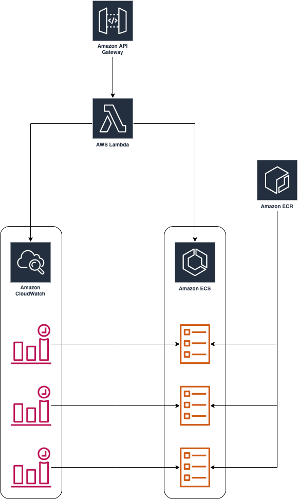
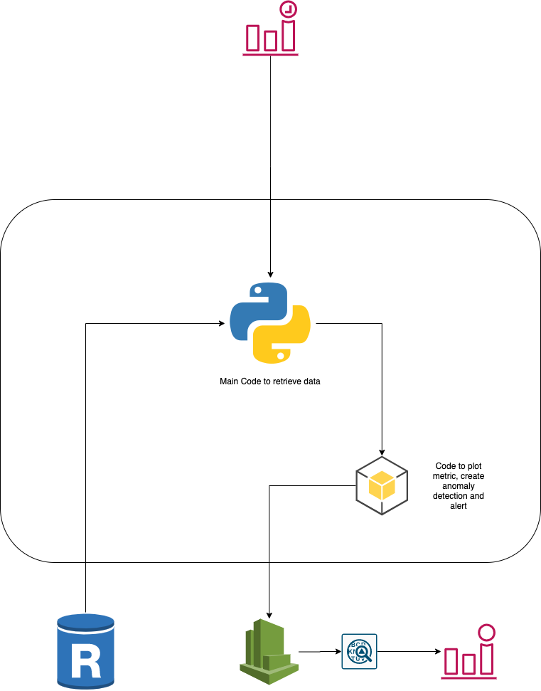

# Business Metrics Plotter #

Self serve solution to plot data business critial metrics to cloudwatch for alerting. It uses [Data science's data-utils](https://bitbucket.org/wicked-ride/data-utils/src/master/). Refer that repo for the database names.

## Current Situation ##

We use Cloudwatch for it’s anomaly detection feature to alert on anomalies in business metrics like Number of bookings, Number of bikes in OOS due to a reason,etc.

Someone comes to the devops team with the query to plot the data and setup alerts. Devops team creates a lambda and a Cloudwatch event to trigger the lambda. We copy the code from an existing lambda and change the query and the Cloudwatch namespace values.

The Cloudwatch event triggers the lambda as a cron and the lambda executes the query and plots the data of the query into Cloudwatch as a time series data.

We manually enable anomaly detection on that metric and set alerts with specified thresholds.

## Proposed Solution ##

Create a self-serve api( maybe even a web app/portal ) that schedules and triggers a docker container which executes code to retreive and plot the data to Cloudwatch. It will also check if an anomaly detection band and it's alarm is already present, else it will create it. 

The image expects variables like the sql query, database name and Cloudwatch details which the user specifies in the request api, which creates the Cloudwatch event and task definition to be scheduled. 

It will use an IAM role for the credentials for cloudwatch and possibly an SNS topic to notify on execution or failure. 

## Architecture ##

**Solution architecture:**

**Plotter container architecture:**

